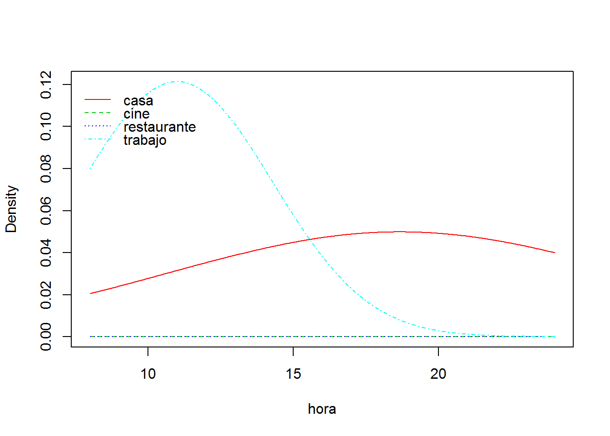
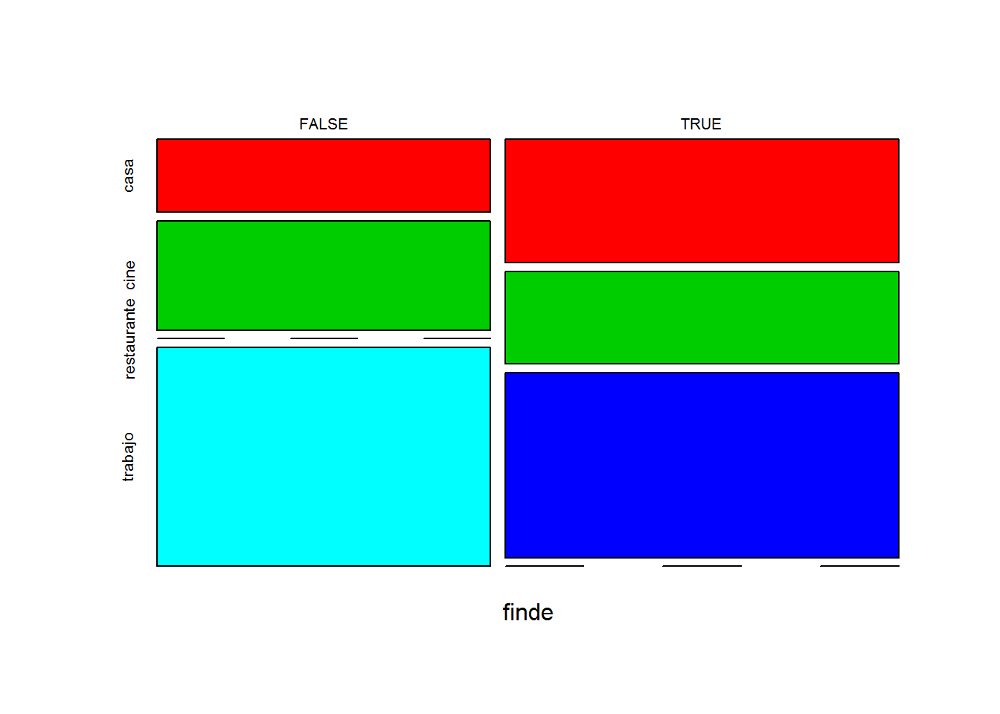
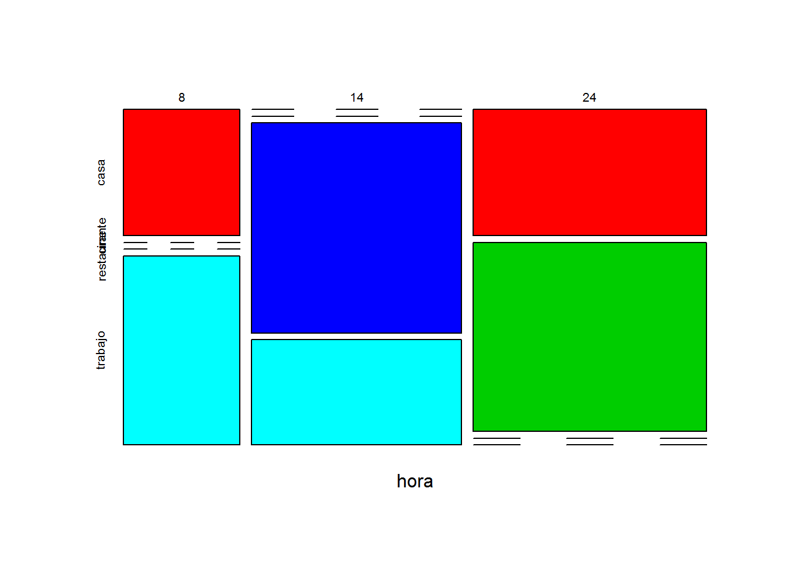
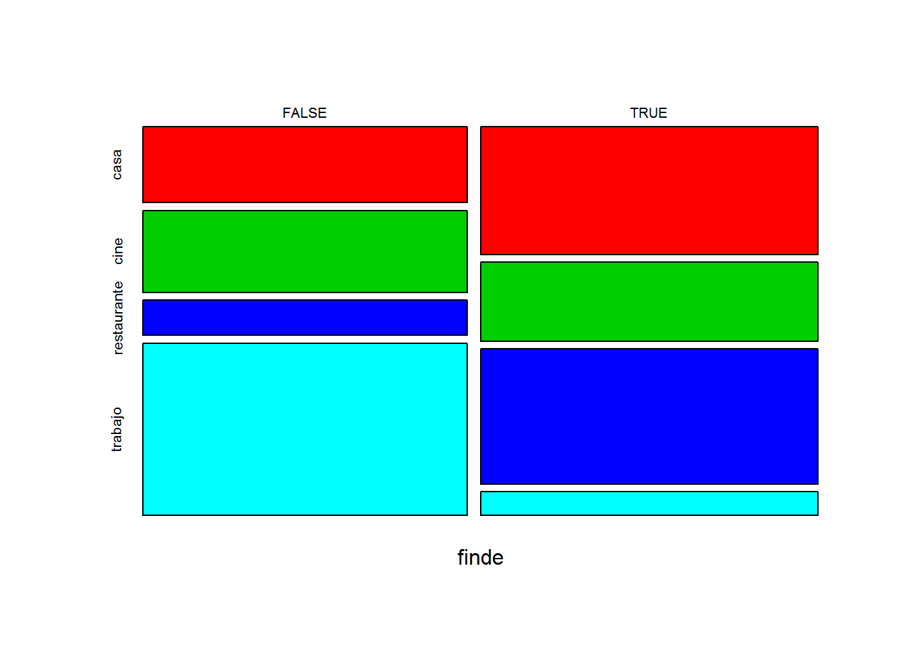

# Naive Bayes- clasificación bayesiano ingenuo {#ingenuo}

*Naive Bayes* es un modelo de predicción basado en la probabilidad Bayesiana. El modelo es muy simple, pero poderoso, en cuanto que es resultado directo de los datos y su tratamiento con simple estadística bayesiana de la probabilidad condicionada. Hay que tener en cuenta que se asume, por simplificación que las variables son todas sucesos independientes.

La función de clasificación ingenua de bayes se encuentra en varias librerías de R en: `naivebayes`, en el paquete `e1071`y en otros.

El modelo bayesiano de probabilidad condicionada se representa como:
$P(A|B) = P(A \cap B) / P(B)$

Es decir, la probabilidad de que se de el caso $A$ dado $B$ es igual a la probabilidad de la intersección de A con B ($A \cap B$ partido la probabilidad de $B$.

Estirando esta formulación llegaríamos al teorema de Bayes cuya expresion mÁs típica es la siguente:

$P(A|B) = PP(B|A)*P(A)/P(B)$


## Crear un modelo con `naivebayes`

La `tabla_1` que vamos a crear contiene 3 variables: la hora del día, el lugar donde está Juan a esa hora, y otra columna que nos indica si es o no fin de semana con un valor lógico (*TRUE o FALSE*).

Vamos a crear la tabla para el ejemplo:

```r
# leemos la base de datos
# tabla_1<-read.csv("tabla_1.csv",header = TRUE)

# vamos a crear el ejemplo de cero: CREAMOS UNA TABLA DE DATOS
tabla_1<-data.frame(hora=c(8,14,24,8,14,24,8,14,24,8,14,24,8,14,24,8,14,24,24,24))
tabla_1$lugar<-c("casa","restaurante","casa",
                 "trabajo","trabajo","casa",
                 "trabajo","trabajo","casa",
                 "casa","restaurante","casa",
                 "trabajo","trabajo","casa",
                 "casa","restaurante","casa","cine","cine")
tabla_1$finde<-c(T,T,T,
                 F,F,F,
                 F,F,F,
                 T,T,T,
                 F,F,F,
                 T,T,T,
                 T,F
                )
str(tabla_1)
```

```
## 'data.frame':	20 obs. of  3 variables:
##  $ hora : num  8 14 24 8 14 24 8 14 24 8 ...
##  $ lugar: chr  "casa" "restaurante" "casa" "trabajo" ...
##  $ finde: logi  TRUE TRUE TRUE FALSE FALSE FALSE ...
```

```r
head(tabla_1)
```

```
##   hora       lugar finde
## 1    8        casa  TRUE
## 2   14 restaurante  TRUE
## 3   24        casa  TRUE
## 4    8     trabajo FALSE
## 5   14     trabajo FALSE
## 6   24        casa FALSE
```

```r
# vemos como ejemplo el numero de registros de hora según el lugar
table(tabla_1$hora,tabla_1$lugar)
```

```
##     
##      casa cine restaurante trabajo
##   8     3    0           0       3
##   14    0    0           3       3
##   24    6    2           0       0
```
Como vemos, es una tabla con 20 regisros y 3 variables en columnas, sobre la que queremos practicar pronósticos bayesianos de probabilidad condicionada.

Vamos cargar la librería `naivebayes` con objeto de crear un modelo de pronóstico de la variable dependiente `lugar` a partir de las variables independientes `hora` y `finde`. Este modelo nos diría por ejemplo la probabilidad de que: sabiendo la hora y si es o no fin de semana, Juan se encuentre en un lugar determinado.

Como vimos en las consideraciones previas, los modelos de pronostico bayesiano, y en particular `naivebayes` funcionan muy mal con datos numéricos continuos, y vamos a ver la prueba, pues crearemos un modelo con la variable hora tal cual, y despues haremos el mismo modelo con la variable hora convertida en factor.

Primero creamos la formula de modelo con la función `naive_bayes()` y luego definimos un hecho, una ocurrencia concreta de los parámetros y llamamos a la función `predict()`.

Esta función es común a la mayoría de los modelos de predictivos, y sus argumentos son el nombre del modelo y un hecho almacenado como data.frame. Si añadimos el argumento `type="prob` nos da el resultado como pronostico probabilistico y si no, solo el pronóstico más probable.


```r
# cargamos la librería    
    library(naivebayes)
# creamos el modelo de pronostico
    m <- naive_bayes(lugar ~ hora+finde, data = tabla_1)#, laplace = 1)

    # representamos graficamente el modelo
    plot(m)
```



```r
# ejecutando predict(modelo) tenemos los resultados de pronostico para cada registro de datos
    tabla_1$p=predict(m)    
    head(tabla_1)
```

```
##   hora       lugar finde           p
## 1    8        casa  TRUE        casa
## 2   14 restaurante  TRUE restaurante
## 3   24        casa  TRUE        cine
## 4    8     trabajo FALSE     trabajo
## 5   14     trabajo FALSE     trabajo
## 6   24        casa FALSE        cine
```

```r
# pero si queremos un hecho concreto:        
# creamos un hecho a priori, sobre el que queremos pronosticar el resultado
# como el modelo es  lugar ~ hora+finde, aportamos un dato de hora y otro de finde
# en este caso queremos pronosticar donde se encuentra Juan a las 14 horas un día laborable
    h<-data.frame(hora= 24, finde=T)
    table(tabla_1$lugar,tabla_1$hora+tabla_1$finde)
```

```
##              
##               8 9 14 15 24 25
##   casa        0 3  0  0  3  3
##   cine        0 0  0  0  1  1
##   restaurante 0 0  0  3  0  0
##   trabajo     3 0  3  0  0  0
```

```r
# llamamos a la función de predición
    predict(m,h) 
```

```
## [1] cine
## Levels: casa cine restaurante trabajo
```

```r
# idam con la probabilidad completa
    predict(m,h, type = "prob")
```

```
##              casa      cine  restaurante trabajo
## [1,] 0.0006001881 0.9993923 7.515315e-06     NaN
```

La predicción que obtenemos con el modelo para *(hora= 24, finde=T)* es claramente erronea, pues solo 1 de los 4 registros que tenemos a las 24 horas en fin de semana es `ir al cine`, los otros 3 son `estar en casa`, por lo que algo falla en el modelo al ser el evento más probable `estar en casa`.

Este problema es habitual cuando usamos datos continuos, que nos generan distribuciones de probabilidad continuas. En este caso el evento de ir al cine tiene muy pocos datos, pero siempre a las 24 horas, por lo que la media se mantiene en 24 h. Sin embargo el hecho estar en casa tienen muchos registros en diferentes horas, por lo que el valor medio de la hora es un número intermedio 18,6 (ver el modelo m para más información). 

Para evitar problemas debemos transformar las variables continuas en discretas y reducir al máximo los valores posibles realizando lo que denominamos una categorización previa de los datos. Por ejemplo convietiendo los datos en factores.


```r
# Convertimos la variable continua numerica hora, en factor discreto
    tabla_1$hora<-as.factor(tabla_1$hora)
    str(tabla_1)
```

```
## 'data.frame':	20 obs. of  4 variables:
##  $ hora : Factor w/ 3 levels "8","14","24": 1 2 3 1 2 3 1 2 3 1 ...
##  $ lugar: chr  "casa" "restaurante" "casa" "trabajo" ...
##  $ finde: logi  TRUE TRUE TRUE FALSE FALSE FALSE ...
##  $ p    : Factor w/ 4 levels "casa","cine",..: 1 3 2 4 4 2 4 4 2 1 ...
```

```r
# calculamos de nuevo el modelo ahora
    m <- naive_bayes(lugar ~ hora+finde, data = tabla_1)
# Hacemos de nuevo la predicción
    predict(m,h)
```

```
## [1] casa
## Levels: casa cine restaurante trabajo
```

```r
    predict(m,h, type="prob")
```

```
##           casa      cine   restaurante trabajo
## [1,] 0.8571429 0.1428571 1.432592e-123     NaN
```

```r
    # ojo al crear el hecho que debe ser acorde a los datos, 
# si es factor debe contener en levels los mismos que la tabla origen
# por ello lo creamos a partir de esta tabla mejor    
    h<-tabla_1[1,c(1,3)]
        h$hora="24"
        h$finde=F
    predict(m,h)
```

```
## [1] casa
## Levels: casa cine restaurante trabajo
```
Como hemos visto al transformar en factor la variable numérica continua, hemos realizado un pronostico más acorde con los datos.


## e1072
Vamos a probar otro paquete que contienen a naive_Bayes el `e1071`. Usaremos los datos de supervivientes del Titanic que vienen en los datasets de R por defecto.
La tabla de datos tiene 32 filas pero en realidad esconde en la columna *freq* el número de repeticiones de cada caso, por lo que el primer paso es crear una tabla completa.


```r
    library(e1071)
    #Cargamos los datos del Titanic dese datasets
    data("Titanic")
    #Los almacenamos en un data frame
    Titanic_df=as.data.frame(Titanic)
    str(Titanic_df)
```

```
## 'data.frame':	32 obs. of  5 variables:
##  $ Class   : Factor w/ 4 levels "1st","2nd","3rd",..: 1 2 3 4 1 2 3 4 1 2 ...
##  $ Sex     : Factor w/ 2 levels "Male","Female": 1 1 1 1 2 2 2 2 1 1 ...
##  $ Age     : Factor w/ 2 levels "Child","Adult": 1 1 1 1 1 1 1 1 2 2 ...
##  $ Survived: Factor w/ 2 levels "No","Yes": 1 1 1 1 1 1 1 1 1 1 ...
##  $ Freq    : num  0 0 35 0 0 0 17 0 118 154 ...
```

```r
    #Creamos una tabla de casos competos a partir de la frecuencia de cada uno
    repeating_sequence=rep.int(seq_len(nrow(Titanic_df)), Titanic_df$Freq) 
    #Esto repite cada caso según la frecuencia dada en la col de la tabla.
    
    #Creamos una nueva tabla repitiendo los casos según el modelo anterior.
    Titanic_dataset=Titanic_df[repeating_sequence,]
    #Ya no necesitamos la tabla de frecuencias más.
    Titanic_dataset$Freq=NULL
    head(Titanic_dataset)
```

```
##     Class  Sex   Age Survived
## 3     3rd Male Child       No
## 3.1   3rd Male Child       No
## 3.2   3rd Male Child       No
## 3.3   3rd Male Child       No
## 3.4   3rd Male Child       No
## 3.5   3rd Male Child       No
```

```r
    # todo son factores
    str(Titanic_dataset)
```

```
## 'data.frame':	2201 obs. of  4 variables:
##  $ Class   : Factor w/ 4 levels "1st","2nd","3rd",..: 3 3 3 3 3 3 3 3 3 3 ...
##  $ Sex     : Factor w/ 2 levels "Male","Female": 1 1 1 1 1 1 1 1 1 1 ...
##  $ Age     : Factor w/ 2 levels "Child","Adult": 1 1 1 1 1 1 1 1 1 1 ...
##  $ Survived: Factor w/ 2 levels "No","Yes": 1 1 1 1 1 1 1 1 1 1 ...
```

```r
    # Ajustamos un modelo de naive bayes con la librería e1071
        m.e1071 <- naiveBayes(Survived ~ ., data = Titanic_dataset)
        m.e1071 # vemos el modelo
```

```
## 
## Naive Bayes Classifier for Discrete Predictors
## 
## Call:
## naiveBayes.default(x = X, y = Y, laplace = laplace)
## 
## A-priori probabilities:
## Y
##       No      Yes 
## 0.676965 0.323035 
## 
## Conditional probabilities:
##      Class
## Y            1st        2nd        3rd       Crew
##   No  0.08187919 0.11208054 0.35436242 0.45167785
##   Yes 0.28551336 0.16596343 0.25035162 0.29817159
## 
##      Sex
## Y           Male     Female
##   No  0.91543624 0.08456376
##   Yes 0.51617440 0.48382560
## 
##      Age
## Y          Child      Adult
##   No  0.03489933 0.96510067
##   Yes 0.08016878 0.91983122
```

```r
    # realizamos la prediccion con el modelo
    predicciones.m<-predict(m.e1071,Titanic_dataset)
    
    # Matriz de confusión 
    table(predicciones.m,Titanic_dataset$Survived)
```

```
##               
## predicciones.m   No  Yes
##            No  1364  362
##            Yes  126  349
```

```r
    hecho<-data.frame(Class="1rd",Sex="Female",Age="Child")
    predict(m.e1071,hecho)
```

```
## [1] Yes
## Levels: No Yes
```


## Corrección de laplace
En muchas ocasiones los datos no contienen muestras a priori de todas las combinaciones de variables posibles, por lo que las probabilidades de casos raros salen excesivamente bajas. Para corregir esto el modelo `naiveBayes` tiene la opción de añadir en la fórmula el argumento de `laplace=1`, en el que indicamos que, al menos, se debe contar con una aparición de cada posible combinación de factores. Este parámetro se puede aumentar a criterio del investigador, y permite incorporar casos raros dentro del pronóstico que de otra forma, por la simplificación del modelo de Bayes, darían probabilidad cero.

Por ejemplo en los datos de Juan y la ubicación según las horas, no tenemos ningún registro de que vaya a trabajar en fin de semana, pero eso no significa que no tengamos cierta probabilidad, lo que se podría solventar añadiendo al modelo `laplace=1`.

Veamos los cambios al reformular el modelo con *laplace*. Gráficamente se aprecia que, por ejemplo, la probabilidad de ir a restaurante entre semana pasa de cero a una cantidad pequeña, y de trabajar el fin de semana igual (pasa de cero a una proporción).


```r
# cargamos la librería    
    require(naivebayes)
# Modelo de pronostico sin laplace
    m <- naive_bayes(lugar ~ hora+finde, data = tabla_1)
    plot(m)
```



```r
# cambiamos el modelo añadiendo laplace con al menos una ocurencia por evento
    m1 <- naive_bayes(lugar ~ hora+finde, data = tabla_1, laplace=1)
    plot(m1)
```



```r
    # ¿ donde está Juan si son las 14 horas en fin de semana?
    h$hora=8
    h$finde=T
    predict(m,h,type="prob") 
```

```
##           casa      cine  restaurante trabajo
## [1,] 0.8571429 0.1428571 2.165259e-12     NaN
```

```r
    predict(m1,h,type="prob") 
```

```
##           casa      cine restaurante      trabajo
## [1,] 0.8790698 0.1209302 1.91539e-39 4.420521e-77
```

