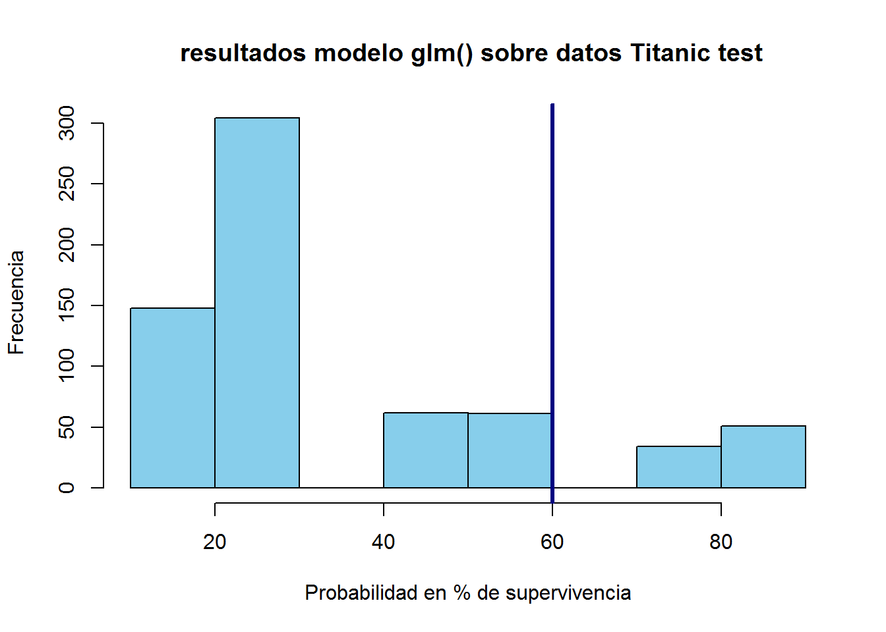
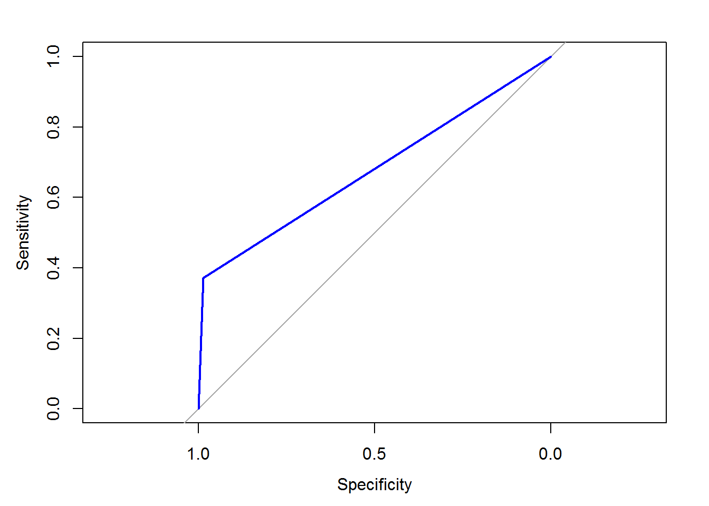
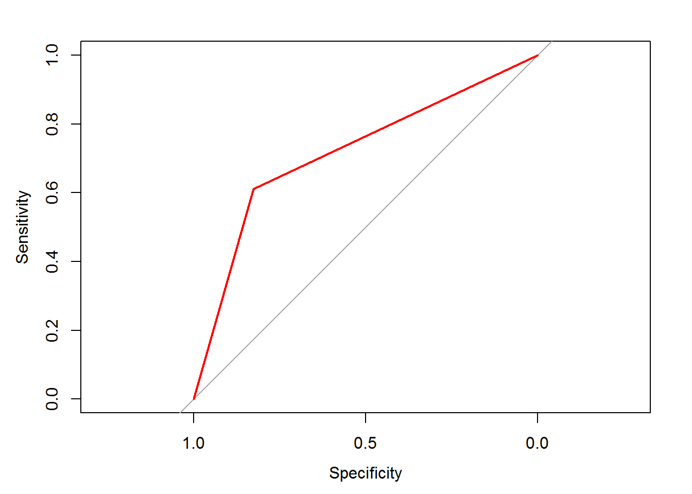
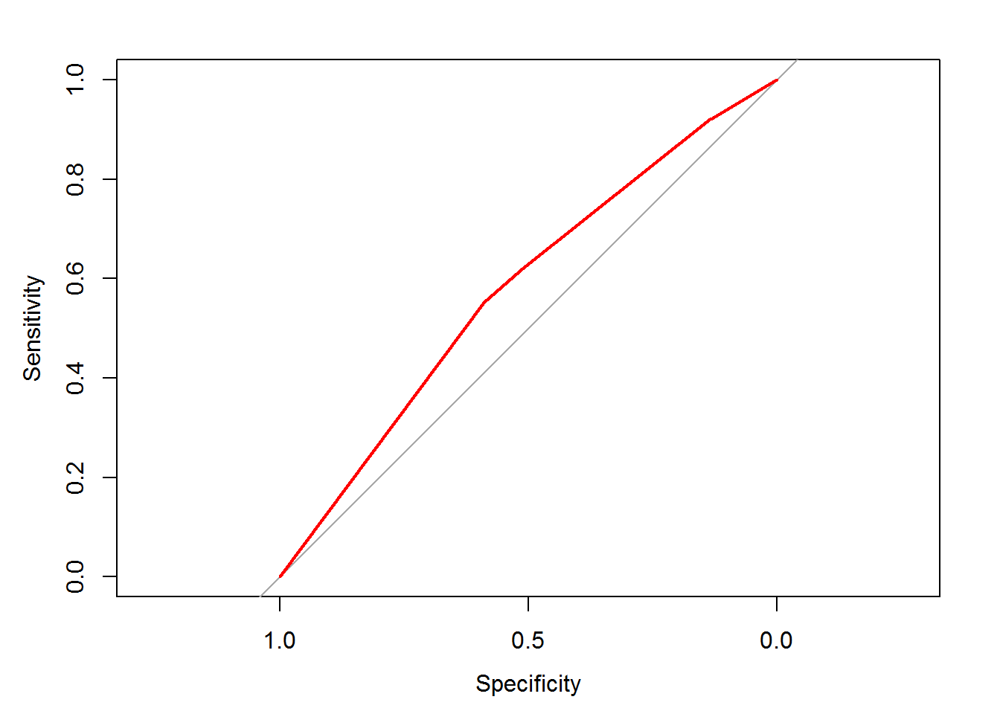
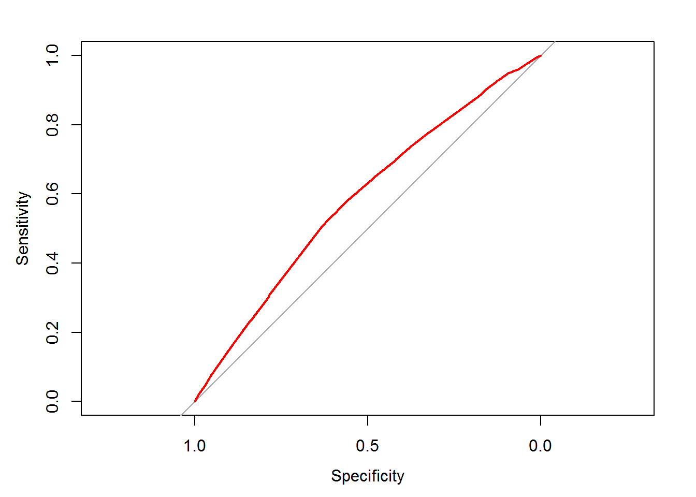
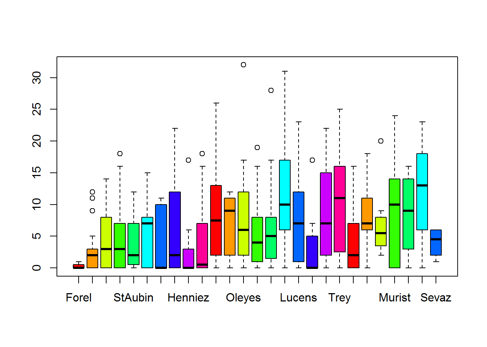

# Regresión logistica binaria {#glm}
Otro modelo de predicción de aprendizaje supervisado es el de **regresión logística**. Se trata de un tipo de análisis de regresión utilizado para predecir el resultado de una variable categórica (aquella que puede adoptar un número limitado de categorías) en función de las variables predictoras. Este modelo se enmarca dentro de los modelos denominados de *predicción lineal generalizados* o *glm* como son conocidos por sus siglas en inglés.

Con el adjetivo binario nos referimos a las predicciones sobre variables binarias o dicotómicas que simplemente tratan de decir si algo es 1 o 0, SI o NO.

Este modelo de pronóstico se usa mucho en variables que se distribuyen en forma de binomial. La binomial es una distribución de probabilidad discreta que cuenta el número de éxitos en una secuencia de *n* ensayos. Si el evento de *éxito* tiene una probabilidad de ocurrencia `p`, la probabilidad del evento contrario -el de *fracaso*- tendrá una probabilidad de $q = 1 - p$. En la distribución binomial se repite el experimento de éxito -fracaso *n* veces, de forma independiente, y se trata de calcular la probabilidad de un determinado número de éxitos *d*, en esas *n* repeticiones $B(n,p)$.


La denominación de *logística* se debe precisamente a la forma de la propia función de distribución de probabilidad binomial que presenta un crecimiento exponencial y que se parece a una $S$ y que toma el nombre matemático de función logística $\frac{1}{1+e^{-t}}$.

Esta curva, es una aproximación continua a la función discreta binaria, pues el cambio de 0 a 1 se produce en corto espacio y muy pronunciado. Si usáramos otras funciones como  la lineal para la regresión de datos binarios funcionaría muy mal, pues el ajuste lineal no capta bien la forma de los datos, las dos agrupaciones que buscamos separar o clasificar.

Los modelos de regresión logísticos se generan con la función `glm()` del paquete base R `stats`, de la siguiente manera.


```r
m <- glm(y ~ x1 + x2 + x3,
           data = my_dataset,
           family = "binomial")

prob <- predict(m, test_dataset, type = "response")

pred <- ifelse(prob > 0.50, 1, 0)
```

Importante reseñar que la predicción se da en **modo de probabilidad**, por lo que para evaluar un pronóstico concreto, se debe establecer qué umbral es el que fija el pronostico 0 o 1. En el caso del ejemplo anterior se ha determinado que para `pred>0,5` el pronostico es 1.

## Construir modelos `glm`

Siguiendo con el uso de la base de datos de ejemplo de supervivientes del Titanic, vamos a crear un modelo logístico que pronostique la variable *Survived*. Podemos ver como se crearon los datos en el apartado de [particiones de los datos](#particiones)

Al igual que todos los modelos de aprendizaje, el modelo se compone de una fórmula, y luego se pronostica con la función `predict()`. En los modelos *glm()*, los únicos argumentos de `predict()` son `response` y `terms`. El primer caso da directamente la probabilidad de la respuesta y el segundo argumento proporciona los coeficientes de cada término en la fórmula. 
Si solo queremos obtener un valor de predicción usaremos `type = "response"`.


```r
# Antes hemos cargado los datos del titanic
# echamos un vistazo a los datos
    head(Titanic_data)
```

```
##     Class  Sex   Age Survived
## 3     3rd Male Child       No
## 3.1   3rd Male Child       No
## 3.2   3rd Male Child       No
## 3.3   3rd Male Child       No
## 3.4   3rd Male Child       No
## 3.5   3rd Male Child       No
```

```r
    table(Titanic_data$Survived)
```

```
## 
##   No  Yes 
## 1490  711
```

```r
# creamos una partición para crear un conjunto de test y otro de entrenamiento
    library(caret)
```

```
## Loading required package: lattice
```

```
## Loading required package: ggplot2
```

```r
    set.seed(123)
# creamos un vector de particion sobre la variable Survived
# el tamaño de muestra será de 75%
    trainIndex=createDataPartition(Titanic_data$Survived, p=0.70)$Resample1
# definimoslos dos conjuntos de muestra
    d_titanic_train=Titanic_data[trainIndex, ] # conjunto entrenamiento
    d_titanic_test= Titanic_data[-trainIndex, ] # conjunto de test
```
Una vez tenemos los conjuntos de test y de aprendizaje creamos el modelo, usando la misma simbología que en el caso de los modelos de naive_bayes.
La peculiaridad de `glm()` es que tenemos que identificar un umbral de probabilidad a partir del que consideramos el pronostico 0 o 1.


```r
    # Construimos el modelo de predicción con la función glm
    m_glm <- glm(Survived ~ Class+Sex, data = d_titanic_train, family = "binomial")
    # resumen del modelo
    summary(m_glm) 
```

```
## 
## Call:
## glm(formula = Survived ~ Class + Sex, family = "binomial", data = d_titanic_train)
## 
## Deviance Residuals: 
##     Min       1Q   Median       3Q      Max  
## -2.1346  -0.7499  -0.4644   0.7435   2.1356  
## 
## Coefficients:
##             Estimate Std. Error z value Pr(>|z|)    
## (Intercept)  -0.2856     0.1678  -1.702   0.0888 .  
## Class2nd     -1.0257     0.2352  -4.362 1.29e-05 ***
## Class3rd     -1.8870     0.2093  -9.017  < 2e-16 ***
## ClassCrew    -0.8394     0.1911  -4.393 1.12e-05 ***
## SexFemale     2.4557     0.1698  14.463  < 2e-16 ***
## ---
## Signif. codes:  0 '***' 0.001 '**' 0.01 '*' 0.05 '.' 0.1 ' ' 1
## 
## (Dispersion parameter for binomial family taken to be 1)
## 
##     Null deviance: 1939.3  on 1540  degrees of freedom
## Residual deviance: 1560.7  on 1536  degrees of freedom
## AIC: 1570.7
## 
## Number of Fisher Scoring iterations: 4
```

```r
    # vemos las predicciones en el conjunto de test
    d_titanic_test$pred<-predict(m_glm, d_titanic_test, type= "response")

    # Hacemos el resumen gráfico del resultado    
        hist(100*d_titanic_test$pred, col="skyblue",
             main=" resultados modelo glm() sobre datos Titanic test",
             xlab="Probabilidad en % de supervivencia",
             ylab="Frecuencia")
    # Marcamos un umbral en el que consideramos el pronostico como donación
    # este umbral lo ponemos en un valor del 60%    
        abline(v= 60,col= "navy", lwd=3)  # marcamos el umbral de supervivencia
```



```r
        d_titanic_test$pred_final_60 <- ifelse(d_titanic_test$pred > 0.6, 1, 0)
        # resumen de resultados
        table(d_titanic_test$pred_final_60)
```

```
## 
##   0   1 
## 575  85
```

```r
    # podemos calcular el ajuste respecto a los casos reales con esta sencilla formula 
    # antes vamos a cambiar los levels de survived No=0, Yes=1 
        table(d_titanic_test$Survived) # vemos cual es el primero ---> No
```

```
## 
##  No Yes 
## 447 213
```

```r
        levels(d_titanic_test$Survived) <- c(0,1)
        mean(d_titanic_test$pred_final_60 == d_titanic_test$Survived)
```

```
## [1] 0.7878788
```

Como vemos una vez realizado el pronostico podríamos probar diferentes umbrales y ver cual es el que da un mejor resultado con esta metodología.

## curvas ROC y AUC
Estas curvas nos ayudan a controlar el acierto o no de los modelos cuando uno de los eventos es muy raro. Esto implica que predecir el evento opuesto conlleva un gran porcentaje de aciertos, y en cierta forma falsea la utilidad real de la predicción lo que hay que vigilar y entender.

En estos casos es mejor sacrificar los aciertos generales en favor de concentrarlos sobre uno de los resultados, el más raro, el que buscamos distinguir.

Por lo tanto la exactitud de la predicción general es una medida engañosa en el rendimiento de lo que realmente nos interesa. Este es un caso muy común en predicciones binomiales pues un caso, el de éxito puede tener una probabilidad general mucho menor que el de fracaso, y un porcentaje de acierto elevado, puede no tener importancia, pues lo que nos interesa no es acertar los fracasos sino los éxitos.

Las curvas ROC son buenas para evaluar este problema en conjuntos de datos desequilibrados.

Al hacer una gráfica **ROC** se representa mejor la compensación entre un modelo que es demasiado agresivo y uno que es demasiado pasivo. Lo que interesa es que el área de la curva sea máxima, cercana a 1, por lo que cuanto más se eleve respecto de la linea media mejor.

Estas gráficas se pintan con la libraría `pROC`. Usaremos dos funciones una para pintar la gráfica y otra que calcula el *AUC* o área bajo la curva.


```r
    # Cargamos la libraría de graficos ROC
    library(pROC)
```

```
## Type 'citation("pROC")' for a citation.
```

```
## 
## Attaching package: 'pROC'
```

```
## The following objects are masked from 'package:stats':
## 
##     cov, smooth, var
```

```r
    # Creamos una curva ROC basada en el modelo glm anterior
    ROC_glm60 <- roc(d_titanic_test$Survived, d_titanic_test$pred_final_60)
    
    # Pintamos la grafica ROC
    plot(ROC_glm60, col = "blue")
```



```r
    #plot(ROC_naive, col = "red")
    
    # Calculamos el area bajo la ROC(AUC)
    auc(ROC_glm60)
```

```
## Area under the curve: 0.6787
```

```r
    d_titanic_test$pred_final_40 <- ifelse(d_titanic_test$pred > 0.4, 1, 0)
    ROC_glm40 <-roc(d_titanic_test$Survived, d_titanic_test$pred_final_40)
    # Pintamos la grafica ROC
    plot(ROC_glm40, col = "red")
```



```r
    auc(ROC_glm40)
```

```
## Area under the curve: 0.7179
```

Vistos los resultados, el seleccionar un umbral de 40, mejora la predicción de casos positivos de supervivencia.


## Modelos de impacto combinado

En las formulaciones de modelos `glm` podemos expresar lo que se denominan impactos combinados o interacciones entre variables. Estos casos se dan cuando el efecto combinado de dos variables es muy importante y superior a la combinación lineal de ellas. Es decir el efecto es exponencial y no lineal sobre la variable a predecir. 

### Ejemplo
Uno de los mejores predictores de donaciones futuras es el historial de donaciones anteriores y cuanto mas recientes, frecuentes y grandes mejor. En términos de comercialización, esto se conoce como R/F/M (Recency Frequency Money).

Es muy probable que el impacto combinado de reciente y frecuencia puede ser mayor que la suma de los efectos por separado, si uno ha dado dinero a una ONG hace muy poco será poco probable que de otra vez enseguida.

Debido a que estos predictores juntos tienen un mayor impacto en la variable dependiente, su efecto conjunto **debe modelarse como una interacción**. Esto en la formulación del modelo se identifica por un `*` en lugar de un `+`.


```r
# Leemos la tabla de datos
    donors<-read.csv("donors.csv",header = TRUE)
    head(donors)
```

```
##   donated veteran bad_address age has_children wealth_rating
## 1       0       0           0  60            0             0
## 2       0       0           0  46            1             3
## 3       0       0           0  NA            0             1
## 4       0       0           0  70            0             2
## 5       0       0           0  78            1             1
## 6       0       0           0  NA            0             0
##   interest_veterans interest_religion pet_owner catalog_shopper recency
## 1                 0                 0         0               0 CURRENT
## 2                 0                 0         0               0 CURRENT
## 3                 0                 0         0               0 CURRENT
## 4                 0                 0         0               0 CURRENT
## 5                 0                 1         0               1 CURRENT
## 6                 0                 0         0               0 CURRENT
##    frequency  money
## 1   FREQUENT MEDIUM
## 2   FREQUENT   HIGH
## 3   FREQUENT MEDIUM
## 4   FREQUENT MEDIUM
## 5   FREQUENT MEDIUM
## 6 INFREQUENT MEDIUM
```

```r
    str(donors)
```

```
## 'data.frame':	93462 obs. of  13 variables:
##  $ donated          : int  0 0 0 0 0 0 0 0 0 0 ...
##  $ veteran          : int  0 0 0 0 0 0 0 0 0 0 ...
##  $ bad_address      : int  0 0 0 0 0 0 0 0 0 0 ...
##  $ age              : int  60 46 NA 70 78 NA 38 NA NA 65 ...
##  $ has_children     : int  0 1 0 0 1 0 1 0 0 0 ...
##  $ wealth_rating    : int  0 3 1 2 1 0 2 3 1 0 ...
##  $ interest_veterans: int  0 0 0 0 0 0 0 0 0 0 ...
##  $ interest_religion: int  0 0 0 0 1 0 0 0 0 0 ...
##  $ pet_owner        : int  0 0 0 0 0 0 1 0 0 0 ...
##  $ catalog_shopper  : int  0 0 0 0 1 0 0 0 0 0 ...
##  $ recency          : Factor w/ 2 levels "CURRENT","LAPSED": 1 1 1 1 1 1 1 1 1 1 ...
##  $ frequency        : Factor w/ 2 levels "FREQUENT","INFREQUENT": 1 1 1 1 1 2 2 1 2 2 ...
##  $ money            : Factor w/ 2 levels "HIGH","MEDIUM": 2 1 2 2 2 2 2 2 2 2 ...
```

```r
# Construimos un modelo complejo
    rfm_model <- glm(donated ~ money + recency* frequency ,data = donors,family = "binomial")
    
# Resumen del modelo RFM 
    summary(rfm_model)
```

```
## 
## Call:
## glm(formula = donated ~ money + recency * frequency, family = "binomial", 
##     data = donors)
## 
## Deviance Residuals: 
##     Min       1Q   Median       3Q      Max  
## -0.3696  -0.3696  -0.2895  -0.2895   2.7924  
## 
## Coefficients:
##                                   Estimate Std. Error z value Pr(>|z|)    
## (Intercept)                       -3.01142    0.04279 -70.375   <2e-16 ***
## moneyMEDIUM                        0.36186    0.04300   8.415   <2e-16 ***
## recencyLAPSED                     -0.86677    0.41434  -2.092   0.0364 *  
## frequencyINFREQUENT               -0.50148    0.03107 -16.143   <2e-16 ***
## recencyLAPSED:frequencyINFREQUENT  1.01787    0.51713   1.968   0.0490 *  
## ---
## Signif. codes:  0 '***' 0.001 '**' 0.01 '*' 0.05 '.' 0.1 ' ' 1
## 
## (Dispersion parameter for binomial family taken to be 1)
## 
##     Null deviance: 37330  on 93461  degrees of freedom
## Residual deviance: 36938  on 93457  degrees of freedom
## AIC: 36948
## 
## Number of Fisher Scoring iterations: 6
```

```r
    #summary(rfm_model)$coefficients
# Calculamos las predicciones del modelo RFM
    rfm_prob <- predict(rfm_model, type = "response")
    head(rfm_prob)
```

```
##          1          2          3          4          5          6 
## 0.06601640 0.04691282 0.06601640 0.06601640 0.06601640 0.04105058
```

```r
# Pintamos la curva ROC para ver el efecto del modelo y calculamos el area AUC
    require(pROC)
    ROC <- roc(donors$donated, rfm_prob)
    plot(ROC, col = "red")
```



```r
    auc(ROC)
```

```
## Area under the curve: 0.5785
```

## Optimización de un modeloS `glm`
Cuando a priori no sabemos qué variables tienen más dependencia para crear el modelo una forma de hacerlo es usando la regresión gradual. Esto consiste en aplicar una función que va incrementando las variables y detecta el mejor modelo de regresión.

Para construirlo hacemos lo siguiente:

 1 creamos un modelo `glm()` sin predictores. se hace estableciendo la variable explicativa igual a 1.
 2 Se crea otro modelo con todos las variables usando `~ .`.
 3 Se aplica la función `step()` entre ambos modelos para realizar una regresión progresiva hacia adelante. Debe indicarse la dirección con `direction = "forward"`
 4 Usamos la función `predict()` sobre la lista de modelos creados con `step`

Veamos el ejemplo:


```r
    # 1. Modelo sin predictores
        null_model <- glm(donated ~1, data = donors, family = "binomial")
    
    # 2. modelo completo
        full_model <- glm(donated ~ ., data = donors, family = "binomial")
    
    # 3. funcion step ()
        step_model <- step(null_model, scope = list(lower = null_model, upper = full_model), direction = "forward")
```

```
## Start:  AIC=37332.13
## donated ~ 1
```

```
## Warning in add1.glm(fit, scope$add, scale = scale, trace = trace, k = k, :
## using the 70916/93462 rows from a combined fit
```

```
##                     Df Deviance   AIC
## + frequency          1    28502 37122
## + money              1    28621 37241
## + wealth_rating      1    28705 37326
## + has_children       1    28705 37326
## + age                1    28707 37328
## + interest_veterans  1    28709 37330
## + catalog_shopper    1    28710 37330
## + pet_owner          1    28711 37331
## <none>                    28714 37332
## + interest_religion  1    28712 37333
## + recency            1    28713 37333
## + bad_address        1    28714 37334
## + veteran            1    28714 37334
## 
## Step:  AIC=37024.77
## donated ~ frequency
```

```
## Warning in add1.glm(fit, scope$add, scale = scale, trace = trace, k = k, :
## using the 70916/93462 rows from a combined fit
```

```
##                     Df Deviance   AIC
## + money              1    28441 36966
## + wealth_rating      1    28493 37018
## + has_children       1    28494 37019
## + interest_veterans  1    28498 37023
## + catalog_shopper    1    28499 37024
## + age                1    28499 37024
## + pet_owner          1    28499 37024
## <none>                    28502 37025
## + interest_religion  1    28501 37026
## + recency            1    28501 37026
## + bad_address        1    28502 37026
## + veteran            1    28502 37027
## 
## Step:  AIC=36949.71
## donated ~ frequency + money
```

```
## Warning in add1.glm(fit, scope$add, scale = scale, trace = trace, k = k, :
## using the 70916/93462 rows from a combined fit
```

```
##                     Df Deviance   AIC
## + wealth_rating      1    28431 36942
## + has_children       1    28432 36943
## + interest_veterans  1    28438 36948
## + catalog_shopper    1    28438 36949
## + age                1    28439 36949
## + pet_owner          1    28439 36949
## <none>                    28441 36950
## + interest_religion  1    28440 36951
## + recency            1    28441 36951
## + bad_address        1    28441 36951
## + veteran            1    28441 36952
## 
## Step:  AIC=36945.26
## donated ~ frequency + money + wealth_rating
```

```
## Warning in add1.glm(fit, scope$add, scale = scale, trace = trace, k = k, :
## using the 70916/93462 rows from a combined fit
```

```
##                     Df Deviance   AIC
## + has_children       1    28421 36937
## + interest_veterans  1    28429 36945
## + catalog_shopper    1    28429 36945
## + age                1    28429 36945
## <none>                    28431 36945
## + pet_owner          1    28430 36945
## + interest_religion  1    28431 36947
## + recency            1    28431 36947
## + bad_address        1    28431 36947
## + veteran            1    28431 36947
## 
## Step:  AIC=36938.08
## donated ~ frequency + money + wealth_rating + has_children
```

```
## Warning in add1.glm(fit, scope$add, scale = scale, trace = trace, k = k, :
## using the 70916/93462 rows from a combined fit
```

```
##                     Df Deviance   AIC
## + pet_owner          1    28418 36937
## + catalog_shopper    1    28418 36937
## + interest_veterans  1    28418 36937
## <none>                    28421 36938
## + interest_religion  1    28420 36939
## + recency            1    28421 36940
## + age                1    28421 36940
## + bad_address        1    28421 36940
## + veteran            1    28421 36940
## 
## Step:  AIC=36932.08
## donated ~ frequency + money + wealth_rating + has_children + 
##     pet_owner
```

```
## Warning in add1.glm(fit, scope$add, scale = scale, trace = trace, k = k, :
## using the 70916/93462 rows from a combined fit
```

```
##                     Df Deviance   AIC
## <none>                    28418 36932
## + interest_veterans  1    28416 36932
## + catalog_shopper    1    28416 36932
## + age                1    28417 36933
## + recency            1    28417 36934
## + interest_religion  1    28417 36934
## + bad_address        1    28418 36934
## + veteran            1    28418 36934
```

```r
        summary(step_model)
```

```
## 
## Call:
## glm(formula = donated ~ frequency + money + wealth_rating + has_children + 
##     pet_owner, family = "binomial", data = donors)
## 
## Deviance Residuals: 
##     Min       1Q   Median       3Q      Max  
## -0.4023  -0.3625  -0.2988  -0.2847   2.7328  
## 
## Coefficients:
##                     Estimate Std. Error z value Pr(>|z|)    
## (Intercept)         -3.05529    0.04556 -67.058  < 2e-16 ***
## frequencyINFREQUENT -0.49649    0.03100 -16.017  < 2e-16 ***
## moneyMEDIUM          0.36594    0.04301   8.508  < 2e-16 ***
## wealth_rating        0.03294    0.01238   2.660 0.007805 ** 
## has_children        -0.15820    0.04707  -3.361 0.000777 ***
## pet_owner            0.11712    0.04096   2.860 0.004243 ** 
## ---
## Signif. codes:  0 '***' 0.001 '**' 0.01 '*' 0.05 '.' 0.1 ' ' 1
## 
## (Dispersion parameter for binomial family taken to be 1)
## 
##     Null deviance: 37330  on 93461  degrees of freedom
## Residual deviance: 36920  on 93456  degrees of freedom
## AIC: 36932
## 
## Number of Fisher Scoring iterations: 6
```

```r
    # estimamos la probabilidad
        step_prob <- predict(step_model, type = "response")
    
    # Pintamos  ROC of the stepwise model
        library(pROC)
        ROC <- roc(donors$donated, step_prob)
        plot(ROC, col = "red")
```



```r
        auc(ROC)
```

```
## Area under the curve: 0.5855
```

## glmmTMB
Existen algunos paquetes específicos de regresión logística para cuando tenemos datos de partida inflados en ceros. Estos casos son más habituales de lo que podemos pensar, pues muchas veces las variables origen tienen media cero con muchos valores cercanos, y lo que buscamos son casos raros fuera del rango habitual (cero).

La librería `library("glmmTMB")` tienes algunas características que mejora este tipo de predicciones, y contiene algoritmos denominados *zero-inflated generalized linear mixed model* o ZIGLMM.

El mejor modelo es el que mejor AIC tiene, para ello tambien es necesario la librería `library("bbmle")`.


Veamos un ejemplo, sobre los datos de muestra de mochuelos (owlets) o polluelos de buho (owl chicks). La base de datos aporta las muestras obtenidas en diferentes nidos durante la cria de mochuelos. Los datos miden el número de llamadas que hace el mochuelo antes de que llegue el progenitor con la comida, y almacena además el tiempo que tarda, el tipo de comida, el lugar del nido y otras variables como el sexo de que llegua a alimentar.

Se registra el número total de llamadas desde el nido, junto con el tamaño total de cría, que se utiliza como compensación para permitir el uso de una respuesta de Poisson.


```r
library("glmmTMB")
library("bbmle")
```

```
## Loading required package: stats4
```

```r
summary(Owls)
```

```
##           Nest      FoodTreatment  SexParent    ArrivalTime   
##  Oleyes     : 52   Deprived:320   Female:245   Min.   :21.71  
##  Montet     : 41   Satiated:279   Male  :354   1st Qu.:23.11  
##  Etrabloz   : 34                               Median :24.38  
##  Yvonnand   : 34                               Mean   :24.76  
##  Champmartin: 30                               3rd Qu.:26.25  
##  Lucens     : 29                               Max.   :29.25  
##  (Other)    :379                                              
##  SiblingNegotiation   BroodSize      NegPerChick     logBroodSize  
##  Min.   : 0.00      Min.   :1.000   Min.   :0.000   Min.   :0.000  
##  1st Qu.: 0.00      1st Qu.:4.000   1st Qu.:0.000   1st Qu.:1.386  
##  Median : 5.00      Median :4.000   Median :1.200   Median :1.386  
##  Mean   : 6.72      Mean   :4.392   Mean   :1.564   Mean   :1.439  
##  3rd Qu.:11.00      3rd Qu.:5.000   3rd Qu.:2.500   3rd Qu.:1.609  
##  Max.   :32.00      Max.   :7.000   Max.   :8.500   Max.   :1.946  
## 
```

```r
head(Owls)
```

```
##         Nest FoodTreatment SexParent ArrivalTime SiblingNegotiation
## 1 AutavauxTV      Deprived      Male       22.25                  4
## 2 AutavauxTV      Satiated      Male       22.38                  0
## 3 AutavauxTV      Deprived      Male       22.53                  2
## 4 AutavauxTV      Deprived      Male       22.56                  2
## 5 AutavauxTV      Deprived      Male       22.61                  2
## 6 AutavauxTV      Deprived      Male       22.65                  2
##   BroodSize NegPerChick logBroodSize
## 1         5         0.8     1.609438
## 2         5         0.0     1.609438
## 3         5         0.4     1.609438
## 4         5         0.4     1.609438
## 5         5         0.4     1.609438
## 6         5         0.4     1.609438
```


Lo primero es hacer algunas transformaciones en los datos:

    1. reordenamos los nidos por el orden de la media de negociaciones por polluelo (para pintar mejor)
    2. añadimos un log del tamaño de cria
    3. renombramos la variable respuesta como NCalls y abreviamos otra FT
    

```r
# SiblingNegotiation - negociacion entre hermanos
# NegPerChick - negativas por polluelo
Owls <- transform(Owls,Nest=reorder(Nest,NegPerChick),NCalls=SiblingNegotiation,FT=FoodTreatment)
head(Owls)
```

```
##         Nest FoodTreatment SexParent ArrivalTime SiblingNegotiation
## 1 AutavauxTV      Deprived      Male       22.25                  4
## 2 AutavauxTV      Satiated      Male       22.38                  0
## 3 AutavauxTV      Deprived      Male       22.53                  2
## 4 AutavauxTV      Deprived      Male       22.56                  2
## 5 AutavauxTV      Deprived      Male       22.61                  2
## 6 AutavauxTV      Deprived      Male       22.65                  2
##   BroodSize NegPerChick logBroodSize NCalls       FT
## 1         5         0.8     1.609438      4 Deprived
## 2         5         0.0     1.609438      0 Satiated
## 3         5         0.4     1.609438      2 Deprived
## 4         5         0.4     1.609438      2 Deprived
## 5         5         0.4     1.609438      2 Deprived
## 6         5         0.4     1.609438      2 Deprived
```

```r
plot(Owls$Nest,Owls$NCalls, col=rainbow(10))
```



Ahora ya podemos hacer el modelo `glmmTMB`. Debemos tener en cuenta que el modelo por defecto usado es un ZIGLMM (ziformula~1), si no queremos usar el inflado de ceros hay que poner (ziformula~0)


Para la formulación de los modelos se toma como estandar la especificación desarrollada en el paquete `lme4`, y cuyo resumen puede verse [aquí](http://bbolker.github.io/mixedmodels-misc/glmmFAQ.html#model-specification) de forma estructurada.


```r
fit_zipoisson <- glmmTMB(NCalls~(FT+ArrivalTime)*SexParent+offset(log(BroodSize))+(1|Nest),data=Owls,ziformula=~1,family=poisson)

confint(fit_zipoisson)
```

```
##                                      2.5 %      97.5 %    Estimate
## cond.(Intercept)                1.84109659  3.23879725  2.53994692
## cond.FTSatiated                -0.40793938 -0.17427339 -0.29110639
## cond.ArrivalTime               -0.09604799 -0.04010818 -0.06807809
## cond.SexParentMale             -0.43318360  1.33087377  0.44884508
## cond.FTSatiated:SexParentMale  -0.03808278  0.24753288  0.10472505
## cond.ArrivalTime:SexParentMale -0.05736075  0.01456575 -0.02139750
## Nest.cond.Std.Dev.(Intercept)   0.25483237  0.50762131  0.35966420
## zi.zi~(Intercept)              -1.24200277 -0.87306435 -1.05753356
```

```r
#summary(fit_zipoisson)

# podemos usar otras aproximaciones 
fit_zinbinom <- update(fit_zipoisson,family=nbinom2)
fit_zinbinom1 <- update(fit_zipoisson,family=nbinom1)
fit_zinbinom1_bs <- update(fit_zinbinom1, . ~ (FT+ArrivalTime)*SexParent+
BroodSize+(1|Nest))

# y usar el comparador de AIC para ver el mejor modelo
AICtab(fit_zipoisson,fit_zinbinom,fit_zinbinom1,fit_zinbinom1_bs)
```

```
##                  dAIC  df
## fit_zinbinom1_bs   0.0 10
## fit_zinbinom1      1.2 9 
## fit_zinbinom      68.7 9 
## fit_zipoisson    666.0 8
```

