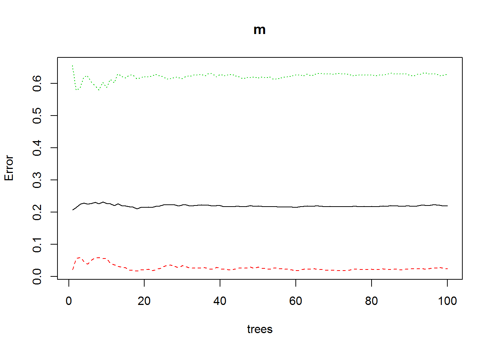

#Bosques aleatorios de decisión {#bosques}
Si aplicamos de manera iterativa el algoritmo que crea árboles de decisión con diferentes parámetros sobre los mismos datos, obtenemos lo que denominamos un bosque aleatorio de decisión (*random forest*).
Este algoritmo es uno de los métodos más eficientes de predicción y más usados hoy día para *big data*, pues promedia muchos modelos con ruido e imparciales reduciendo la variabilidad final del conjunto.

En realidad lo que se hace es construir diferentes conjuntos de entrenamiento y de test sobre los mismos datos, lo que genera diferentes árboles de decisión sobre los mismos datos, la unión de estos árboles de diferentes complejidades y con datos de origen distinto aunque del mismo conjunto resulta un bosque aleatorio, cuya principal característica es que crea modelos más robustos de los que se obtendrían creando un solo árbol de decisión complejo sobre los mismos datos.

**El ensamblado de modelos (arboles de decisión) distintos genera predicciones mas robustas**. Los grupos de árboles de clasificación se combinan y se deduce una única predicción votada en democracia por la población de árboles.

El paquete `randomForest` en R nos permite crear este tipo de modelos de manera muy sencilla.

## Ejemplo de bosque aleatorio
Vamos a utilizar los datos de supervivientes del Titanic para crear un bosque aleatorio. La tabla origen la creamos a partir de la muestra de datasets como vimos en el apartado de [particiones de los datos](#particiones).

Tenemos un conjunto de entrenamiento almacenado como `d_titanic_train`. En esta muestra no hay NA, pero si los datos contuviesen NA habría que imputar o quitar los registros antes de ejecutar el modelo, por ejemplo con `complete.cases(d_titanic_train)` 


```r
# Cronstuir un bosque de decisión
    library(randomForest)
```

```
## randomForest 4.6-14
```

```
## Type rfNews() to see new features/changes/bug fixes.
```

```r
#creamos el modelo
    m <- randomForest(Survived ~ .,
                  data = d_titanic_train[complete.cases(d_titanic_train),],
                  ntree = 100    # numero de arboles en el bosque
                  ) 
    plot(m) # pintamos evolucion de arboles del modelo
```



```r
# borramos predicciones anteriores
    d_titanic_test$pred<-NULL
    d_titanic_test$pred_final_60<-NULL
    d_titanic_test$pred_final_40<-NULL    
#titanic_test$p<-NULL

# Hacemos las predicciones y las almacenamos en la col p.
        d_titanic_test$pred <- predict(m, d_titanic_test)
        levels(d_titanic_test$pred)<- c(0,1) # cambiamos los levels como hicimos en apartado 1
        
# calculamos la bondad de la prediccion
  #  mean(d_titanic_test$pred == d_titanic_test$Survived)
# vemos los datos
    head(d_titanic_test,10)
```

```
##      Class  Sex   Age Survived pred
## 3.3    3rd Male Child       No    0
## 3.14   3rd Male Child       No    0
## 3.15   3rd Male Child       No    0
## 3.16   3rd Male Child       No    0
## 3.21   3rd Male Child       No    0
## 3.23   3rd Male Child       No    0
## 3.24   3rd Male Child       No    0
## 3.30   3rd Male Child       No    0
## 3.32   3rd Male Child       No    0
## 3.34   3rd Male Child       No    0
```


# Resumen 
Hemos visto 5 métodos de clasificación dentro del grupo de los denominados **aprendizaje supervisado**.  algoritmos  para la generación de pronósticos a partir de datos. Cada una de estas metodologías tiene sus peculiaridades, pero tanto la forma de crear el modelo como la de llamar a la función de predicción son muy parecidas, por lo que vamos a realizar una tabla resumen en la que podamos fijarnos cada vez que estemos buscando un modelo de predicción de aprendizaje supervisado.

El modelo *knn* es el único que da la predicción en la misma fórmula, no en otra función. Para cada algoritmo daremos bajo su denominación, la librería en la que se carga, la formula de construcción del modelo, y la formula de predicción, así como las notas más importantes sobre su uso. 


## Crear particiones en los datos

 1. Con el paquete `caret`
    - library(caret) , partición de 70/30
    - `trainIndex=createDataPartition(misdatos$var1, p=0.70)$Resample1`
    - Los dos conjuntos serán:
      * `d_train=misdatos[trainIndex, ]`  --> conjunto entrenamiento
      * `d_test= misdatos[-trainIndex, ]` --> conjunto de test
 2. Con uso de sample
    - Contamos el número de registros de la base de datos origen y calculamos el 70% ( el % deseado) de dicha cantidad: `ndat<-as.integer(0.7*nrow(misdatos))`
    - Creamos una muestra aleatoria de registros: `reg_train <- sample(nrow(misdatos), ndat)`
    - Creamos el conjunto de registros de entrenamiento: `mdatos_train <- misdatos[reg_train,]`
    - Creamos el conjunto de registros de test: `mdatos_test <- misdatos[-reg_train,]`


## Tabla resumen de modelos
 1. **knn**
    - library(class) 
    - `m<-knn(train = tabla_train, test = tabla_test, cl = tabla_train$col_clasificadora)`
    - el resultado de la función es el tipo de clase `cl` al que pertenecen los datos de la tabla_test
    - Para optimizar los resultados el modelo necesita estandarizar las variables normalizar distancias
        * scale(tabla)
 1. **naivebayes**
    - library(naivebayes)
    - `m<-naive_bayes(var_dependiente ~ var1 + var2..., data = tabla_datos, laplace = n)` laplace es opcional y agrega n casos para cada supuesto combinatorio.
    - `predict(m)` predicción sobre toda la tabla origen
    - `predict(m,h,type="prob")`  siendo `h` un hecho en `data.frame`.
        - `type = "prob"`  muestra probabilidad de cada clase de salida, si se omite el type, el resultado es la clasificación más probable.
 1. **naivebayes_e1071**
    - library(e1071)
    - `m<-naiveBayes(var_dependiente ~ ., data = tabla_datos_train)`
    - `predict(m)` predicción sobre toda la tabla origen `tabla_datos_train`, ,`type="prob"` opcional 
    - `predict(m,tabla_datos_test)`
 1. **Regresión logistica** `glm`
    - library(stats), cargada por defecto con R base.
    - `m_glm<-glm(y ~ x1 + x2 + x3,data = misdatos_train, family = "binomial")`
    - `m_glm<-glm(y ~ x1*x2, data = misdatos_train, family = "binomial")`  para variables con impacto combinado, efecto conjunto exponencial sobre la variable dependiente.
    - probabilidad: `prob <- predict(m_glm, misdatos_test, type = "response")` usar tipo response
    - umbral de predicción: `pred <- ifelse(prob > 0.50, 1, 0)`
    - `summary(m_glm)` 
 1. **Optimizacion de regresión logistica** `glm`
    - Se usa para hallar el mejor modelo de pronóstico, definiendo un inicio y fin de modelos:  
        1.Modelo sin predictores: `null_model <- glm(var1 ~ 1, data = misdatos, family = "binomial")`
        2.Modelo completo: `full_model <- glm(var1 ~ ., data = misdatos, family = "binomial")`
        3. función step(): `step_model <- step(null_model, scope = list(lower = null_model, upper = full_model), direction = "forward")`
    - `summary(step_model)` da el resultado de las pruebas con el mejor modelo
    - Para estimar la probabilidad: `step_prob <- predict(step_model, type = "response")`
 1. **Árboles de decisión**
    - los datos origen a clasificar deben ser factores o estar categorizados. No es conveniente usar datos continuos.
    - `library(rpart)`
    - Hay que definir una poda `poda<-rpart.control(cp= 0.2, maxdepth = 30, minsplit = 20)`que limita el árbol, lo más común es usar solo cp=0.2.
    - `m_tree<-rpart(var_dependiente ~ ., data = tabla_datos_train, control = poda)` 
    - `predict(m_tree, h,type = "class")` predicción sobre el hecho `h`
    - `predict(m,tabla_datos_test)` predicción sobre los datos de test
    - Se puede dibujar el árbol con rpart.plot:
        `rpart.plot(m_tree, type = 2, clip.right.labs = FALSE,`
        `branch = .6,`
        `box.palette = c( "red","green"),`       
        `main = "Ejemplo de arbol \n lalala")`
 1. **Bosques aleatorios**.
    - Los bosques son sumas de modelos de árboles. Por lo que es mejor no usar datos continuos sino categorizados.
    - `library(randomForest)`
    - `m_bosque <- randomForest(var_dependiente ~ ., data = tabla_datos_train[complete.cases(tabla_datos_train),], ntree = 100 )`  Hemos excluido todos los posibles NA, pero podría hacerse previamente un `impute` de estos datos.
    - `predict(m_bosque)` predicción sobre toda la tabla origen  
    - `predict(m_bosque,tabla_datos_test)`, predicción sobre los datos de test 
    - Pintamos la evolución del modelo y vemos a partir de qué numero de arboles los resultados son homogéneos: `plot(m_bosque)`


